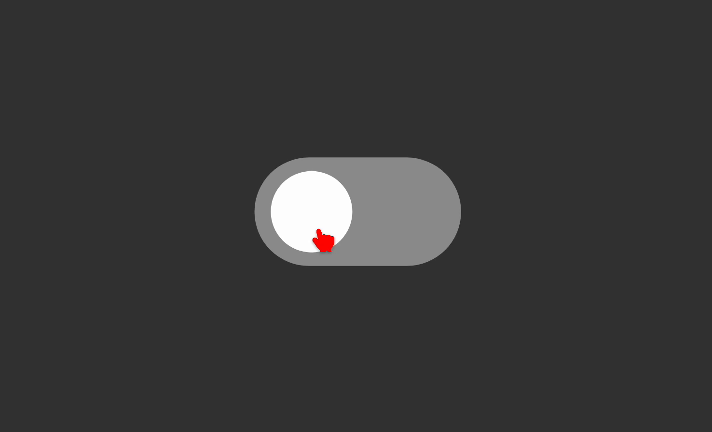

# TiaLib

<br>

<p>
    è una libreria creata da me con lo scopo di velocizzare i tempi di creazione di piccoli componenti copiando ed incollando.
</p>

---

<br>

## Come usarla?

<p>
    copiare il tag sottostante ed incollarlo nel head dell'html
</p>

```   html
<link rel="stylesheet" href="https://mattiaortolani.github.io/TiaLib/css/TiaLib.css">
```

---

<br>

## Toggle button

<p align="center">
    
</p>

``` html
<input type="checkbox" name="" id="1" class="toggle-button">
<label for="1" class="button">
    <div class="button__circle"></div>
</label>
```


<p>input radio trasformato in un toggle, cambiare l' <span style="font-weight: 800;">id</span> ed il parametro <span style="font-weight: 800;">for</span> per settarlo al meglio in JS. <br> utilizzare lo style: <code>transform: scale(1);</code> per aumentarne o diminuirne la grandezza.</p>

<br>
